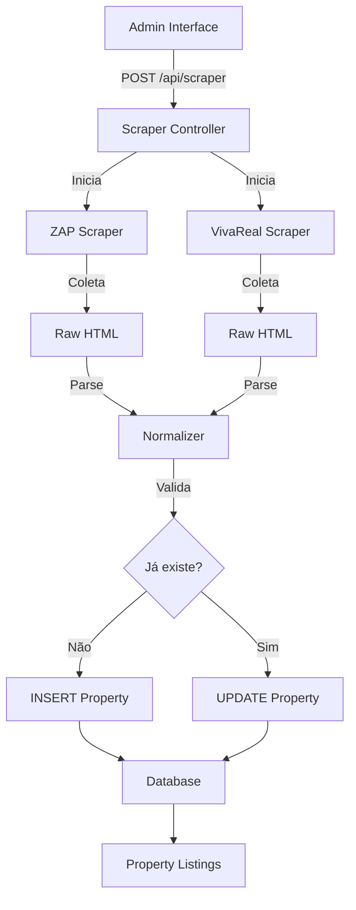

# Automated Property Scraping System

**Objetivo**: Implementar sistema automatizado para coletar imóveis de portais imobiliários (ZapImóveis e VivaReal) e armazená-los no banco de dados da plataforma Litoral Norte Imóveis.

## Contexto

O banco de dados já possui suporte completo para scraping:

- **PropertySource enum**: `ZAP`, `VIVAREAL`, `MULTIPLE`, `USER`
- **Campos de scraping**: `externalId`, `scrapedAt`, `url`
- **Detecção de duplicatas**: via `externalId` único
- **Índices otimizados**: city, source, status, type, propertyType

## User Review Required

> [!IMPORTANT]
> **Fontes de Scraping**: Confirme quais portais você deseja priorizar:
>
> - ZapImóveis
> - VivaReal
> - Outros (OLX, QuintoAndar, etc.)?

> [!IMPORTANT]
> **Filtros de Scraping**: Deseja limitar a busca por:
>
> - Cidades específicas (Caraguatatuba, Ubatuba, São Sebastião, Ilhabela)?
> - Tipos de imóveis (Casa, Apartamento, Terreno, etc.)?
> - Faixa de preço?
> - Apenas venda ou incluir aluguel?

> [!IMPORTANT]
> **Modo de Execução**: Como você prefere executar o scraping?
>
> - **Manual**: Via interface web (botão "Importar Imóveis")
> - **Agendado**: Cron job automático (diário, semanal, etc.)
> - **Ambos**: Interface manual + agendamento

> [!CAUTION]
> **Considerações Legais**: O scraping de sites pode violar os Termos de Serviço dos portais. Considere:
>
> - Usar APIs oficiais quando disponíveis
> - Implementar rate limiting (atrasos entre requisições)
> - Respeitar robots.txt
> - Adicionar User-Agent identificável

---

## Proposed Changes

### Scraping Infrastructure

#### [NEW] [lib/scrapers/base.ts](file:///Users/marcelodifoggiajunior/Desktop/Projetos%20AI/litoral-norte-imoveis/lib/scrapers/base.ts)

**Classe base** para todos os scrapers com:

- Interface comum (`IScraper`)
- Rate limiting automático
- Error handling padrão
- Logging estruturado
- Retry logic

```typescript
interface ScraperConfig {
  source: PropertySource;
  baseUrl: string;
  delayMs: number; // Delay entre requisições
  maxRetries: number;
  timeout: number;
}

interface ScrapedProperty {
  externalId: string;
  type: string;
  propertyType: string;
  title: string;
  description?: string;
  price: number;
  area?: number;
  bedrooms?: number;
  bathrooms?: number;
  parkingSpaces?: number;
  city: string;
  neighborhood?: string;
  address?: string;
  url: string;
  photoUrls: string[];
  latitude?: number;
  longitude?: number;
}
```

---

#### [NEW] [lib/scrapers/zap.ts](file:///Users/marcelodifoggiajunior/Desktop/Projetos%20AI/litoral-norte-imoveis/lib/scrapers/zap.ts)

**Scraper para ZapImóveis**:

- Busca por cidade e tipo
- Extração de dados estruturados
- Paginação automática
- Normalização de dados

**Seletores principais**:

- Listagens: `.result-card`
- Título: `h2.result-card__title`
- Preço: `.result-card__price`
- Detalhes: `.result-card__details`

---

#### [NEW] [lib/scrapers/vivareal.ts](file:///Users/marcelodifoggiajunior/Desktop/Projetos%20AI/litoral-norte-imoveis/lib/scrapers/vivareal.ts)

**Scraper para VivaReal**:

- Similar ao ZAP mas com seletores específicos
- Extração de JSON-LD quando disponível
- Fallback para HTML parsing

---

#### [NEW] [lib/scrapers/normalizer.ts](file:///Users/marcelodifoggiajunior/Desktop/Projetos%20AI/litoral-norte-imoveis/lib/scrapers/normalizer.ts)

**Normalizador de dados**:

- Padronização de cidades (ex: "Caraguá" → "Caraguatatuba")
- Padronização de tipos (ex: "Apto" → "apartamento")
- Conversão de preços (remover "R$", ".", etc.)
- Validação com Zod schemas
- Cálculo de `pricePerSqm`

---

### API Endpoints

#### [NEW] [app/api/scraper/route.ts](file:///Users/marcelodifoggiajunior/Desktop/Projetos%20AI/litoral-norte-imoveis/app/api/scraper/route.ts)

**POST /api/scraper** - Inicia scraping manual

```typescript
// Request
{
  "sources": ["ZAP", "VIVAREAL"],
  "filters": {
    "cities": ["Caraguatatuba", "Ubatuba"],
    "type": "venda",
    "propertyTypes": ["apartamento", "casa"],
    "minPrice": 100000,
    "maxPrice": 1000000
  },
  "limit": 100 // Máximo de imóveis por fonte
}

// Response
{
  "jobId": "abc123",
  "status": "running",
  "startedAt": "2026-02-05T21:00:00Z"
}
```

**GET /api/scraper/{jobId}** - Status do scraping

```typescript
{
  "jobId": "abc123",
  "status": "completed",
  "progress": {
    "total": 150,
    "processed": 150,
    "saved": 127,
    "duplicates": 23,
    "errors": 0
  },
  "logs": [...]
}
```

---

#### [MODIFY] [app/api/properties/route.ts](file:///Users/marcelodifoggiajunior/Desktop/Projetos%20AI/litoral-norte-imoveis/app/api/properties/route.ts)

**Adicionar lógica** para lidar com propriedades scraped:

- Detectar duplicatas via `externalId`
- Update em vez de insert se já existe
- Marcar `scrapedAt` timestamp

---

### Admin Interface

#### [NEW] [app/admin/scraper/page.tsx](file:///Users/marcelodifoggiajunior/Desktop/Projetos%20AI/litoral-norte-imoveis/app/admin/scraper/page.tsx)

**Painel de controle** para scraping:

- Formulário de configuração (filtros, fontes)
- Botão "Iniciar Scraping"
- Monitoramento em tempo real (polling de status)
- Histórico de execuções
- Estatísticas (total scraped, duplicatas, erros)

**Requer**: Autenticação + role `ADMIN`

---

### Scheduling (Opcional)

#### [NEW] [lib/cron/scraper-job.ts](file:///Users/marcelodifoggiajunior/Desktop/Projetos%20AI/litoral-norte-imoveis/lib/cron/scraper-job.ts)

**Agendamento automático**:

- Usar Vercel Cron Jobs ou node-cron
- Executar diariamente (configurável)
- Enviar relatório por email/notificação

**Vercel Cron** (em `vercel.json`):

```json
{
  "crons": [
    {
      "path": "/api/scraper/cron",
      "schedule": "0 2 * * *"
    }
  ]
}
```

---

### Dependencies

Adicionar ao `package.json`:

```json
{
  "dependencies": {
    "cheerio": "^1.0.0-rc.12",
    "axios": "^1.6.0",
    "puppeteer-core": "^21.0.0", // Opcional, para sites com JS
    "@vercel/blob": "já instalado"
  }
}
```

---

### Database

**Nenhuma migração necessária** - o schema já suporta scraping! ✅

Usar campos existentes:

- `source`: `PropertySource.ZAP` ou `PropertySource.VIVAREAL`
- `externalId`: ID único do portal (para detectar duplicatas)
- `scrapedAt`: Timestamp da última coleta
- `url`: Link para o anúncio original

---

### Error Handling & Logging

#### [NEW] [lib/scrapers/logger.ts](file:///Users/marcelodifoggiajunior/Desktop/Projetos%20AI/litoral-norte-imoveis/lib/scrapers/logger.ts)

**Sistema de logs**:

- Logs estruturados (JSON)
- Níveis: `info`, `warn`, `error`
- Persistir em arquivo ou BD (opcional)
- Métricas: tempo de execução, taxa de sucesso

---

### Data Flow



---

## Verification Plan

### Automated Tests

#### 1. Scraper Unit Tests

**Arquivo**: `lib/scrapers/__tests__/zap.test.ts`

```bash
npm test -- lib/scrapers/__tests__/zap.test.ts
```

**Testes**:

- Parsing de HTML mockado
- Normalização de dados
- Detecção de duplicatas
- Error handling

---

#### 2. API Integration Tests

**Arquivo**: `app/api/scraper/__tests__/route.test.ts`

```bash
npm test -- app/api/scraper/__tests__/route.test.ts
```

**Testes**:

- POST cria job de scraping
- GET retorna status correto
- Autenticação necessária

---

### Manual Verification

#### 1. Scraping Manual (via Interface)

1. Faça login como ADMIN
2. Acesse `/admin/scraper`
3. Configure filtros:
   - Fonte: "ZAP"
   - Cidade: "Caraguatatuba"
   - Tipo: "Venda"
   - Limite: 10
4. Clique "Iniciar Scraping"
5. **Resultado esperado**: Barra de progresso aparece, mostrando status em tempo real

#### 2. Verificar Dados Salvos

1. Acesse `/imoveis`
2. Filtre por cidade "Caraguatatuba"
3. **Resultado esperado**: Imóveis scraped aparecem na listagem
4. Verifique badges de origem (ZAP/VivaReal)
5. Clique em um imóvel scraped
6. **Resultado esperado**: Link "Ver anúncio original" redireciona para o portal

#### 3. Testar Detecção de Duplicatas

1. Execute o scraping 2 vezes com os mesmos filtros
2. Acesse o banco de dados (Prisma Studio: `npm run db:studio`)
3. **Resultado esperado**:
   - Mesma quantidade de imóveis (não duplicados)
   - Campo `scrapedAt` atualizado

#### 4. Verificar Error Handling

1. Desconecte internet / bloqueie acesso ao ZAP
2. Execute scraping
3. **Resultado esperado**:
   - Erro é exibido na interface
   - Logs mostram tentativas de retry
   - Scraping de outras fontes continua

---

### Performance Tests

Execute scraping com limite de **100 imóveis**:

- **Tempo esperado**: 2-5 minutos (depende do rate limiting)
- **Memória**: < 500MB
- **Taxa de sucesso**: > 90%

---

## Rollout Plan

### Phase 1: MVP (Manual Scraping)

- [ ] Implementar ZAP scraper
- [ ] API endpoint POST /api/scraper
- [ ] Interface admin básica
- [ ] Testar com 10-20 imóveis

### Phase 2: Production Ready

- [ ] Adicionar VivaReal scraper
- [ ] Implementar rate limiting robusto
- [ ] Adicionar logs e métricas
- [ ] Aumentar para 100+ imóveis

### Phase 3: Automation

- [ ] Adicionar Vercel Cron Jobs
- [ ] Sistema de notificações
- [ ] Dashboard de analytics

---

## Custos Estimados

**Vercel Pro** (necessário para Cron Jobs):

- $20/mês

**Alternativa grátis**:

- Usar GitHub Actions para agendamento
- Chamar API via webhook
